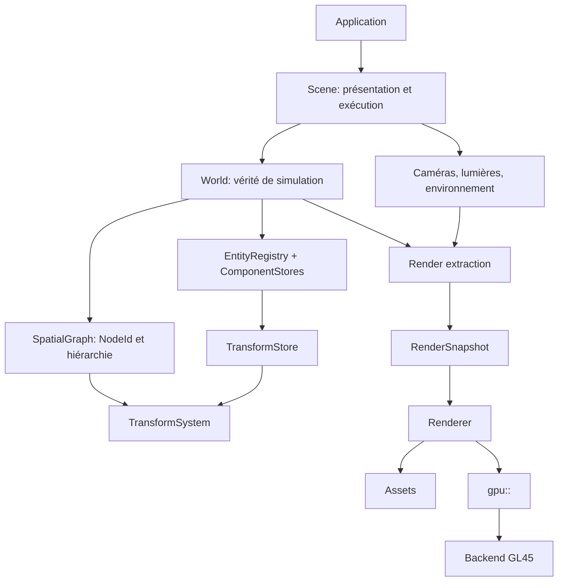

# Architecture logicielle — Gloop

## 0. Statut et rôle de ce document

Ce document définit l’architecture cible de Gloop à partir de l’état réel du
dépôt. Il remplace les anciennes descriptions qui mélangeaient :

- ce qui est déjà implémenté ;
- une architecture future ;
- les types du dossier legacy `src/Scene`.

Chaque décision appartient désormais à l’une des catégories suivantes :

- **Acquis** : implémenté, testé et à préserver ;
- **Cible** : contrat à atteindre par les prochaines refontes ;
- **Legacy** : code conservé comme référence, mais qui ne définit plus
  l’architecture ;
- **Éventuel** : évolution rendue possible, mais qui ne doit pas compliquer le
  présent.

`doc/Design.md` décrit les raisons de conception de la couche `gpu::` actuelle
et le prototype World Niveau 1. Le présent document porte la cible globale.
Lorsqu’une différence existe, elle doit être explicitement décrite comme une
migration, jamais masquée.

---

## 1. Vision

Gloop vise un moteur 3D C++ moderne, léger et orienté simulation, combinant :

- la rapidité de création d’une scène de Three.js ;
- un petit modèle Entity/Component inspiré de Unity ;
- des données contiguës adaptées aux traitements de masse ;
- une couche GPU utilisable pour le rendu comme pour le calcul.

Le moteur doit offrir deux niveaux d’usage.

### 1.1 API pratique

L’utilisateur doit pouvoir charger, instancier et observer un monde sans
assembler lui-même chaque passe GPU :

```cpp
World world;
Scene scene(world);

auto car = world.instantiate("car.glb");
world.transform(car).position({ 10.0f, 0.0f, 20.0f });

scene.setCamera(camera);
engine.run(scene);
```

Cette API est une cible. Elle n’existe pas encore sous cette forme.

### 1.2 API bas niveau

La couche GPU reste directement accessible pour les simulations et rendus
spécialisés :

```cpp
auto particles = gpu::Buffer<Particle>::create(
    1'000'000,
    gpu::BufferKind::Storage,
    gpu::BufferUsage::Storage);

compute.dispatchItems(particles.value().count());
gpu::barrier(gpu::Barrier::Storage);
```

Cette capacité est acquise dans `src/GPU`.

### 1.3 Flux fondamental

```text
World
  → Simulation
  → TransformSystem
  → Render extraction
  → Renderer
  → gpu::
  → Backend
```

Le rendu représente le monde ; il ne le possède pas et ne pilote pas sa
simulation.

---

## 2. État réel du dépôt

### 2.1 Acquis : `src/GPU`

La couche `gpu::` est le socle graphique actuel. Elle est fonctionnelle,
testée et couverte par les exemples 01 à 16.

Elle fournit notamment :

- un backend OpenGL 4.5 isolé dans `src/GPU/Backends/GL45` ;
- des handles typés et générationnels ;
- des pools de ressources contigus ;
- des propriétaires de ressources move-only ;
- `gpu::Result<T>` et `gpu::Status` ;
- des buffers typés pour vertex, index, uniform et storage ;
- textures, framebuffers, shaders, programs et pipelines ;
- layouts vertex déclarés côté C++ et validés contre le shader ;
- états de rendu immuables dans les pipelines ;
- `RenderPass` et les appels `draw*` immédiats ;
- compute shaders, SSBO, barrières et ping-pong ;
- statistiques de rendu et de ressources.

Les contraintes suivantes sont acquises et ne doivent pas régresser :

1. aucun type OpenGL public ;
2. aucun `gl*` hors du backend ;
3. un mesh peut alimenter plusieurs pipelines ;
4. les erreurs de layout et de shader sont détectées avant le draw ;
5. un buffer écrit par compute peut être réutilisé par le rendu ;
6. la fenêtre et GLFW restent hors de la bibliothèque GPU.

### 2.2 Expérimental : `src/World`

`src/World` est un prototype utile, mais pas encore le contrat définitif.

Il valide déjà plusieurs choix :

- `Entity` est un handle index + génération ;
- la hiérarchie utilise `parent`, `first_child`, `next_sibling` et
  `prev_sibling` ;
- transforms locaux, matrices monde et dirty flags sont séparés ;
- les nœuds ne possèdent pas de callbacks virtuels de rendu ;
- le rendu collecte les renderables au lieu d’appeler `onDraw` sur l’arbre.

Il contient aussi des choix à corriger :

- `World` connaît directement `gpu::` et effectue le rendu ;
- caméra, lumière, matériau, mesh et rendu sont mélangés au noyau spatial ;
- l’échelle parentale n’est pas propagée aux enfants ;
- les composants optionnels utilisent encore des recherches linéaires ;
- `TransformAuthority` est stocké dans la valeur locale sans être appliqué ;
- `World::render` tient lieu à la fois d’extraction, de queue et de renderer.

L’exemple 17 est expérimental. Il ne constitue pas une preuve de stabilité tant
que son rendu n’est pas validé visuellement et par un test GPU hiérarchique.

### 2.3 Legacy : `src/Scene`

`src/Scene` n’est pas compilé. Il reste une source d’idées et d’assets de test,
mais pas une API à conserver telle quelle.

Les éléments à ne pas réintroduire sont :

- `vector<unique_ptr<Node>>` comme stockage principal ;
- allocations individuelles par nœud ;
- hiérarchie de classes pour représenter les données ;
- `onDraw` virtuel par objet ;
- mélange Scene Graph, gameplay et rendu ;
- ressources OpenGL possédées par les objets de scène.

Les concepts utiles du legacy peuvent être réimplémentés au-dessus des
nouveaux contrats : API pratique, comportements, formes, ShaderLib, loaders,
animation et contrôleurs de caméra.

---

## 3. Architecture cible

### 3.1 Modèle général



### 3.2 Règle d’identité

Les concepts suivants sont distincts :

```text
Entity != SpatialNode != Component != GameObject
```

- une `Entity` est une identité du World ;
- un `SpatialNode` est une relation hiérarchique spatiale ;
- un composant est une donnée spécialisée associée à une Entity ;
- un éventuel `GameObject` est une façade ergonomique, pas un propriétaire de
  données lourdes.

Le Scene Graph ne constitue pas un deuxième système d’entités. Un nœud
référence une Entity existante.

`SpatialGraph` est indépendant au sens des dépendances et de la testabilité,
mais il est composé et possédé par le `World` qui fournit les entités. Il ne
possède pas de registre d’entités concurrent.

### 3.3 Sens des dépendances

```text
Application
  ├── Scene → World → SpatialGraph / Components / Systems
  └── Renderer → Assets
         └────→ gpu:: → Backend
```

Une flèche signifie « utilise ». L’inverse est interdit.

En particulier :

- `World` ne dépend pas de `Renderer`, de `Scene` ni de `gpu::` ;
- `SpatialGraph` ne dépend ni du rendu ni de la physique ;
- `Renderer` lit un snapshot, mais ne modifie pas le World ;
- `gpu::` ne connaît ni mesh métier, ni matériau métier, ni Entity ;
- le backend ne voit pas les types du moteur.

---

## 4. World : vérité de la simulation

### 4.1 Responsabilité

Le `World` possède :

- le registre des entités ;
- les component stores de simulation ;
- le stockage des transforms ;
- le graphe spatial associé ;
- les systèmes et leur ordre d’exécution ;
- le temps et les événements propres à la simulation.

Le `World` ne possède pas :

- la fenêtre ;
- le contexte GPU ;
- les réglages de présentation ;
- la caméra active ;
- l’environnement visuel ;
- les pipelines GPU ;
- la render queue.

Un World doit pouvoir évoluer en mode headless :

```cpp
World world;

while (simulationRunning)
{
    world.update(dt);
}

save(world);
```

### 4.2 Entity

Une Entity est un handle compact et générationnel :

```cpp
struct Entity
{
    uint32_t index;
    uint32_t generation;
};
```

La largeur exacte est une décision d’implémentation. La cible ne doit pas être
limitée implicitement à 65 535 entités.

Propriétés requises :

- copie peu coûteuse ;
- valeur nulle explicite ;
- détection des handles périmés ;
- réutilisation contrôlée des slots ;
- sérialisation possible ;
- aucun pointeur vers une allocation d’entité.

### 4.3 Component stores

Les composants sont stockés par type :

```text
TransformStore
RigidBodyStore
ColliderStore
VehicleStore
RenderableStore
AnimatorStore
BehaviorStore
```

Chaque store choisit la représentation adaptée à ses traitements :

- dense SoA pour les données parcourues en masse ;
- sparse set pour les composants optionnels ;
- AoS compact pour les données rarement parcourues champ par champ.

« Data-oriented » ne signifie pas découper chaque struct sans mesure. La
représentation doit suivre le système qui consomme les données.

API cible :

```cpp
World world;
Entity car = world.create();

world.add<Transform>(car);
world.add<RigidBody>(car);
world.add<Vehicle>(car);
```

---

## 5. SpatialGraph : organisation spatiale

### 5.1 Responsabilité

Le graphe répond uniquement à la question :

> Où cette entité se trouve-t-elle, et à quoi est-elle spatialement attachée ?

Il contient :

- l’association Node → Entity ;
- les relations parent/enfant ;
- les informations nécessaires au parcours ;
- aucun composant de gameplay ;
- aucune ressource de rendu ;
- aucun callback virtuel.

### 5.2 Identifiants et nœuds

`NodeId` est un handle générationnel distinct d’`Entity`.

```cpp
struct SpatialNode
{
    Entity entity;
    NodeId parent;
    NodeId firstChild;
    NodeId nextSibling;
    NodeId prevSibling;
};
```

Les nœuds résident dans des tableaux contigus. `prevSibling` est conservé pour
permettre un détachement en O(1).

Une Entity peut ne pas être spatiale. Une Entity spatiale possède au plus un
nœud dans un graphe donné.

### 5.3 Invariants

Le graphe garantit :

- absence de cycle ;
- parent vivant ou nul ;
- une Entity au plus par nœud ;
- un nœud au plus par Entity ;
- invalidation générationnelle après destruction ;
- destruction et reparentage aux sémantiques explicites.

Le reparentage ne doit jamais avoir une sémantique implicite. Deux opérations
peuvent être exposées :

```cpp
graph.attach(child, parent, KeepLocal);
graph.attach(child, parent, KeepWorld);
```

`KeepLocal` conserve le TRS local. `KeepWorld` recalcule le local afin de
préserver la pose monde, si la matrice parentale est inversible.

---

## 6. Transforms

### 6.1 Source de vérité

Le transform local est la seule donnée éditable primaire :

```cpp
struct LocalTransform
{
    Vec3 position;
    Quat rotation;
    Vec3 scale;
};
```

Le transform monde est un cache dérivé :

```cpp
struct WorldTransform
{
    Matrix4 matrix;
};
```

Une décomposition monde position/rotation/scale peut être calculée ou mise en
cache si un système en a réellement besoin. Elle ne devient pas une seconde
source de vérité.

### 6.2 Composition officielle

La hiérarchie suit la sémantique TRS standard de Three.js et Unity :

```text
WorldMatrix(root)  = LocalMatrix(root)
WorldMatrix(child) = WorldMatrix(parent) × LocalMatrix(child)
```

L’échelle parentale affecte donc les positions, rotations effectives et
échelles des descendants.

Le comportement expérimental actuel où seule la partie rigide du parent est
propagée doit être supprimé. Si un besoin de hiérarchie sans héritage
d’échelle apparaît, il devra être représenté par un nœud intermédiaire ou par
une fonctionnalité future explicitement nommée ; ce n’est pas la sémantique
par défaut.

### 6.3 Stockage data-oriented

`LocalTransform` est une valeur d’API et d’échange. Il n’impose pas un
`vector<LocalTransform>` en interne.

Le stockage cible peut être :

```text
TransformStore
  entities[]
  positions[]
  rotations[]
  scales[]
  worldMatrices[]
  dirty[]
  authorities[]
```

L’API de modification peut retourner une vue/proxy ou proposer des setters.
Elle doit garantir qu’une écriture marque le transform et ses descendants
comme dirty.

```cpp
world.transform(entity).setPosition({ 1.0f, 2.0f, 3.0f });
```

Une référence mutable brute vers une valeur interne n’est acceptable que si
le dirty tracking reste impossible à contourner.

### 6.4 TransformSystem

Le système :

1. reçoit les modifications locales ;
2. marque les descendants affectés ;
3. traite les parents avant les enfants ;
4. calcule les matrices monde ;
5. publie un état stable en lecture seule pour les systèmes suivants.

L’optimisation peut évoluer :

- parcours DFS depuis les racines ;
- liste topologique linéarisée ;
- sous-arbres dirty ;
- lots de nœuds indépendants ;
- calcul parallèle.

Le contrat mathématique ne doit pas changer avec l’optimisation.

### 6.5 Autorité d’écriture

L’autorité n’appartient pas à la valeur TRS :

```text
TransformAuthorityStore
  entity[]
  authority[]
```

Valeurs initiales possibles :

```text
Game
Physics
Animation
```

L’autorité détermine quel système écrit le local pendant une phase donnée.
Elle évite qu’une animation et la physique modifient implicitement le même
transform.

---

## 7. Scene : contexte de présentation

### 7.1 Responsabilité

Une `Scene` n’est pas propriétaire des entités du World. Elle décrit comment
un World est observé et présenté.

```cpp
struct Scene
{
    World* world;
    CameraStore cameras;
    LightStore lights;
    Environment environment;
    RenderSettings renderSettings;
};
```

Cette forme est conceptuelle : l’API finale peut encapsuler ses membres.

Une même simulation peut être présentée par plusieurs scènes :

- vue joueur ;
- minimap ;
- éditeur ;
- capture hors écran ;
- visualisation scientifique.

### 7.2 Caméras et lumières

Une caméra ou une lumière de Scene référence une Entity spatiale du World pour
sa pose, sans posséder son transform.

```cpp
struct Camera
{
    Entity pose;
    Projection projection;
    Viewport viewport;
};
```

Chaque frame produit une valeur immuable :

```cpp
struct CameraFrame
{
    Matrix4 view;
    Matrix4 projection;
    Matrix4 viewProjection;
    Vec3 position;
    Frustum frustum;
};
```

Inverses, jitter et reverse-Z sont des extensions futures. Ils ne doivent être
ajoutés que lorsqu’un pass les consomme.

Les lumières de présentation suivent la même règle : données photométriques
dans la Scene, pose référencée dans le World.

---

## 8. Render extraction et Renderer

### 8.1 Frontière

Le World ne dessine pas. Il expose des données de simulation et des composants
de rendu déclaratifs, par exemple :

```cpp
struct Renderable
{
    MeshAssetId mesh;
    MaterialInstanceId material;
    AABB localBounds;
    RenderFlags flags;
};
```

Ce composant ne contient ni `gpu::Pipeline`, ni pointeur de matériau, ni appel
de rendu.

### 8.2 Snapshot de rendu

L’extraction construit une représentation immuable de la frame :

```cpp
struct RenderItem
{
    Entity entity;
    MeshAssetId mesh;
    MaterialInstanceId material;
    Matrix4 worldMatrix;
    AABB worldBounds;
    RenderFlags flags;
};

struct RenderSnapshot
{
    CameraFrame camera;
    Span<const RenderItem> items;
    Span<const LightFrame> lights;
    EnvironmentFrame environment;
};
```

Le snapshot :

- ne contient pas de pointeur mutable vers le World ;
- reste valide pendant la consommation de la frame ;
- permet plus tard de séparer simulation et rendu par thread ;
- fige les données nécessaires au rendu, pas tout le World.

### 8.3 Renderer

Le `Renderer` :

1. reçoit un `RenderSnapshot` ;
2. effectue le frustum culling ;
3. choisit passes, pipelines et variantes ;
4. construit et trie les queues ;
5. résout les assets vers des ressources `gpu::` ;
6. émet les appels `gpu::`.

Tri initial :

```text
pass
  → pipeline
  → material
  → mesh
  → profondeur
```

Le tri par adresse de pointeur n’est pas un contrat acceptable. Les clés sont
des identifiants stables ou des clés de pipeline calculées.

### 8.4 Multi-pass

Le modèle doit permettre à un même mesh d’être consommé par :

- pass profondeur ;
- ombres ;
- opaque ;
- transparent ;
- sélection éditeur ;
- debug normals.

Cette exigence s’appuie directement sur l’acquis `gpu::` : le layout et le
buffer ne sont pas enfermés dans un unique shader.

---

## 9. Couche `gpu::`

### 9.1 API actuelle à préserver

`gpu::` utilise un device implicite par processus :

```cpp
gpu::init(loadProc);
// ressources, passes, draw, compute
gpu::shutdown();
```

Il n’existe actuellement ni classe publique `GraphicsDevice`, ni
`CommandBuffer`, ni `ResourceState`.

Le backend OpenGL traduit immédiatement les opérations. Cette forme est
cohérente et doit rester la référence tant qu’un second backend n’impose pas
une évolution prouvée.

### 9.2 Ownership GPU

Les wrappers typés possèdent les ressources :

```text
gpu::Buffer<T>
gpu::Texture
gpu::Program
gpu::Pipeline
gpu::Framebuffer
```

Les handles sont copiables et non-owning. Copier un handle ne prolonge pas la
durée de vie de la ressource.

Les couches Assets et Renderer possèdent les wrappers nécessaires. Le World ne
stocke que des identifiants d’assets.

### 9.3 Évolutions éventuelles

Les éléments suivants restent possibles :

- backend Vulkan ;
- device explicite ;
- command buffers enregistrés ;
- resource states et barrières portables ;
- fences ;
- samplers séparés ;
- représentation shader portable.

Ils ne doivent pas être simulés dans l’API actuelle sans besoin concret. Un
backend futur doit préserver autant que possible la simplicité de `gpu::`.

---

## 10. Assets et ressources métier

### 10.1 AssetManager

L’`AssetManager` possède, charge, met en cache et déduplique :

```text
MeshAsset
TextureAsset
Material
MaterialInstance
AnimationClip
Skeleton
Prefab
Model
```

Un Asset ID est stable du point de vue du moteur. Les handles GPU associés
peuvent être reconstruits après perte ou recréation du contexte.

### 10.2 glTF / GLB

GLB/glTF est le format runtime principal.

Le loader traduit :

- nodes → Entity + SpatialNode + Transform ;
- primitives → MeshAsset ;
- matériaux et textures → assets ;
- caméras et lumières → données de Scene ;
- skins et animations → composants et assets d’animation.

Le loader ne doit pas appeler directement OpenGL. Il produit des descriptions
CPU, puis l’AssetManager crée ou programme les ressources `gpu::`.

### 10.3 Material et MaterialInstance

```text
Material
  shader family
  render state
  parameter layout

MaterialInstance
  MaterialId
  parameter values
  texture bindings
```

Plusieurs instances partagent un Material. Plusieurs entités peuvent partager
la même instance si leurs paramètres sont identiques.

ShaderLib doit produire une description de matériau et de shader. Elle ne doit
pas posséder de types backend ou fabriquer des objets OpenGL.

---

## 11. Systèmes et ordre d’une frame

L’ordre d’écriture doit être explicite :

```text
Platform input
  → Gameplay / Behavior
  → Physics
  → Physics-to-local transform sync
  → Animation
  → TransformSystem
  → Scene evaluation
  → Render extraction
  → Renderer
  → gpu::
```

Cet ordre pourra devenir configurable, mais ses dépendances devront rester
déclarées.

Exemples d’autorité :

- une caisse dynamique : Physics → LocalTransform ;
- une porte animée : Animation → LocalTransform ;
- une caméra libre : Game → LocalTransform ;
- un objet cinématique : Game/Animation → Physics.

Aucun système ne doit corriger silencieusement la sortie d’un autre système au
milieu de la frame.

---

## 12. API haut niveau et façade objet

Une façade objet est autorisée si elle ne devient pas le stockage :

```cpp
class GameObject
{
public:
    TransformView transform();

    template<typename T>
    ComponentView<T> get();

private:
    World* m_world;
    Entity m_entity;
};
```

Elle peut offrir une ergonomie Three.js/Unity :

```cpp
auto player = scene.instantiate("Player.prefab");
player.transform().setPosition({ 0.0f, 1.0f, 0.0f });
player.get<Animator>().play("Idle");
```

Mais :

- elle ne contient pas les composants ;
- elle ne possède pas les ressources ;
- elle ne reçoit pas de `onDraw` ;
- sa destruction n’invalide rien sans opération explicite sur le World.

Les Behaviors sont des composants ou systèmes de gameplay. Ils peuvent
recevoir `onEnable`, `onDisable`, `onStart` et `onUpdate`, mais jamais prendre
la responsabilité du rendu.

---

## 13. Ownership

```text
World
  owns EntityRegistry, simulation components, TransformStore, SpatialGraph

Scene
  owns presentation configuration, cameras, lights, environment

AssetManager
  owns CPU assets and their GPU realizations

Renderer
  owns render infrastructure, queues, transient frame resources

gpu::
  owns backend resource records through typed wrappers and pools

Application
  owns Platform, World, Scene, AssetManager, Renderer
```

Règles :

1. une Entity ne possède jamais une ressource GPU ;
2. un SpatialNode ne possède jamais un composant ;
3. un composant référence un asset par ID, pas par pointeur owning ;
4. une Scene référence un World dont la durée de vie la dépasse ;
5. un snapshot possède ou référence de façon bornée les données de sa frame ;
6. toute référence non-owning a une durée de vie documentée.

---

## 14. Mémoire et performance

Priorités :

```text
contiguous storage
stable IDs
generation checks
batch processing
explicit ownership
measured optimization
```

À éviter dans les données massives :

- allocation heap par élément ;
- graphe de pointeurs ;
- virtual dispatch par entité pendant le rendu ;
- recherche linéaire pour chaque accès composant ;
- copie CPU inutile entre compute et draw ;
- état GPU caché dans les objets métier.

La performance ne justifie pas une API incohérente. Les optimisations doivent
être prouvées par les statistiques existantes, des benchmarks ou des scènes de
charge.

---

## 15. Roadmap à partir de l’état réel

### Étape 0 — Socle acquis

État :

- `gpu::` et backend GL45 fonctionnels ;
- exemples GPU 01 à 16 ;
- tests GPU et compteurs de ressources ;
- `src/Scene` hors build ;
- prototype `src/World` et exemple 17 non validés comme cible.

Critère de stabilité : préserver les exemples et tests existants pendant les
refontes supérieures.

### Étape 1 — Spatial core

Livrables :

- Entity générationnelle sans limite silencieuse à 16 bits ;
- SpatialGraph séparé du World monolithique ;
- NodeId distinct d’Entity et mapping un-à-un optionnel ;
- TransformStore ;
- TRS standard avec héritage d’échelle ;
- dirty propagation et reparentage explicite ;
- tests de translation, rotation, échelle, reparentage, cycles et handles
  périmés.

Critère de sortie : le robot hiérarchique est mathématiquement correct sans
aucun type GPU.

### Étape 2 — Extraction et Renderer minimal

Livrables :

- Renderable à base d’Asset IDs ;
- CameraFrame immuable ;
- RenderSnapshot ;
- Renderer séparé ;
- culling, tri stable et pass opaque minimal ;
- test GPU d’une hiérarchie multi-mesh ;
- exemple 17 visuellement fonctionnel.

Critère de sortie : `World` ne dépend plus de `GPU/*`.

### Étape 3 — Scene de présentation

Livrables :

- Scene référençant un World ;
- CameraStore et LightStore ;
- environnement et RenderSettings minimaux ;
- plusieurs vues possibles d’un même World.

Critère de sortie : changer de caméra ou de cible ne modifie pas la simulation.

### Étape 4 — Assets et GLB

Livrables :

- AssetManager ;
- MeshAsset, TextureAsset, Material et MaterialInstance ;
- chargement GLB statique ;
- cache et déduplication ;
- instanciation de la hiérarchie importée.

Critère de sortie : un modèle Blender statique apparaît avec sa hiérarchie,
ses textures et ses matériaux sans code GPU utilisateur.

### Étape 5 — Animation

Livrables :

- AnimationClip ;
- Skeleton et Skin ;
- AnimationMixer / Action ;
- interpolation, lecture, boucle et crossfade ;
- skinning GPU ;
- autorité Animation sur les transforms concernés.

Critère de sortie : un GLB animé joue au moins deux clips avec transition.

### Étape 6 — Gameplay

Livrables :

- Behavior sans callback de rendu ;
- InputState indépendant de GLFW ;
- événements et timers ;
- contrôleurs de caméra ;
- raycast spatial.

Critère de sortie : une petite scène interactive n’accède directement ni à
GLFW ni à `gpu::`.

### Étape 7 — Physique

Livrables :

- PhysicsWorld ;
- rigid bodies, colliders, triggers ;
- synchronisation explicite avec TransformStore ;
- autorité Physics ;
- raycasts physiques.

Critère de sortie : objets dynamiques, cinématiques et animés ne se disputent
pas l’écriture d’un transform.

### Étape 8 — Rendu avancé

Livrables progressifs :

- PBR ;
- environnement HDR ;
- ombres ;
- transparence ;
- post-process ;
- particules ;
- debug draw.

Chaque fonctionnalité est un pass ou une extension du Renderer, jamais un
callback sur les entités.

### Étape 9 — Simulation GPU

Livrables :

- component data transférable par lots ;
- compute produisant des données directement dessinables ;
- indirect draw lorsque pertinent ;
- synchronisation CPU/GPU explicite ;
- lecture CPU seulement lorsque nécessaire.

Cette étape s’appuie sur les capacités déjà démontrées par les exemples
compute. Elle ne nécessite pas de réécrire le World entier sur GPU.

### Étape 10 — Confort de production

Évolutions possibles :

- Prefab ;
- sérialisation de Scene et World ;
- hot reload d’assets ;
- audio ;
- navigation ;
- éditeur ;
- threading simulation/rendu ;
- second backend.

---

## 16. Migration progressive

### 16.1 Principe

La migration se fait par tranche verticale :

```text
contrat
  → tests CPU
  → implémentation
  → test GPU si nécessaire
  → exemple
  → documentation
```

Chaque étape doit laisser le dépôt compilable et démontrable.

### 16.2 `src/World`

Ordre recommandé :

1. extraire EntityRegistry ;
2. introduire SpatialGraph ;
3. introduire TransformStore et la composition TRS correcte ;
4. adapter les tests World ;
5. créer les types d’extraction ;
6. déplacer le draw dans Renderer ;
7. adapter l’exemple 17 ;
8. supprimer les helpers temporaires de mesh et matériau du noyau World.

### 16.3 `src/Scene`

Le legacy n’est pas déplacé fichier par fichier.

Pour chaque fonctionnalité :

1. identifier le contrat utilisateur utile ;
2. écrire un type de données indépendant du backend ;
3. l’intégrer au bon propriétaire ;
4. porter ou remplacer son exemple ;
5. supprimer l’ancien code devenu sans usage.

Les anciens `GameObject`, `SceneTree::Node`, `Behavior::onDraw` et ressources
OpenGL ne sont pas des dépendances de transition acceptables.

### 16.4 Compatibilité

La compatibilité source avec `src/Scene` n’est pas un objectif. Une petite
façade moderne peut reprendre les noms utiles si leur sémantique respecte les
nouveaux contrats.

---

## 17. Critères de qualité

Une fonctionnalité est correctement intégrée si :

### Architecture

- son propriétaire est explicite ;
- elle respecte le sens des dépendances ;
- elle ne mélange pas simulation et présentation ;
- elle n’expose pas OpenGL hors backend ;
- elle fonctionne sans façade objet.

### Données

- les handles périmés sont détectés ;
- les données massives sont parcourables par lots ;
- les relations utilisent des IDs stables ;
- la représentation est adaptée aux systèmes qui la consomment ;
- les caches dérivés ne deviennent pas des sources de vérité.

### Rendu

- aucun appel GPU n’est émis par une Entity ou un Behavior ;
- un mesh peut participer à plusieurs passes ;
- les queues utilisent des clés stables ;
- les ressources sont libérées et observables dans les statistiques ;
- le culling ne change pas l’état du World.

### Validation

- tests CPU pour les règles métier et mathématiques ;
- tests GPU ciblés pour les frontières de rendu ;
- exemple visuel pour chaque tranche verticale ;
- erreurs explicites plutôt que rendu silencieusement vide ;
- documentation mise à jour avec le code.

---

## 18. Non-objectifs immédiats

Les éléments suivants ne doivent pas retarder le spatial core et le Renderer
minimal :

- ECS universel ou framework de systèmes générique ;
- éditeur complet ;
- backend Vulkan ;
- multithreading prématuré ;
- réseau ;
- FBX ;
- format binaire propriétaire ;
- abstraction anticipée de toutes les API graphiques ;
- reproduction exhaustive d’Unity ou Unreal.

Gloop doit rester petit. Chaque abstraction doit résoudre un besoin démontré
par un test, un exemple ou une fonctionnalité de la roadmap.

---

## 19. Décisions résumées

1. `gpu::` actuel est un acquis.
2. World est la source de vérité de la simulation.
3. Entity est une identité générationnelle.
4. SpatialNode est une relation spatiale, pas une Entity.
5. Le Scene Graph n’est pas un second registre d’entités.
6. Transform local est éditable ; transform monde est dérivé.
7. La composition hiérarchique est un TRS standard avec héritage d’échelle.
8. Parent appartient au SpatialNode, pas au Transform.
9. L’autorité d’écriture appartient au système, pas à la valeur TRS.
10. Scene décrit comment observer et présenter un World.
11. World ne connaît ni Renderer ni `gpu::`.
12. Le rendu passe par un snapshot immuable et des queues triées.
13. AssetManager possède les assets ; World ne stocke que leurs IDs.
14. Une façade GameObject peut exister, mais ne possède pas les données.
15. `src/Scene` est migré par fonctionnalité puis supprimé progressivement.
16. Les abstractions graphiques futures restent éventuelles tant qu’un besoin
    réel ne les impose pas.

La chaîne cible est donc :

```text
GLB / Prefab / Code
        ↓
AssetManager + World
        ↓
Entity + Components + SpatialGraph
        ↓
TransformSystem
        ↓
Scene
        ↓
Render extraction
        ↓
RenderSnapshot
        ↓
Renderer
        ↓
gpu::
        ↓
GL45 backend
        ↓
GPU
```
