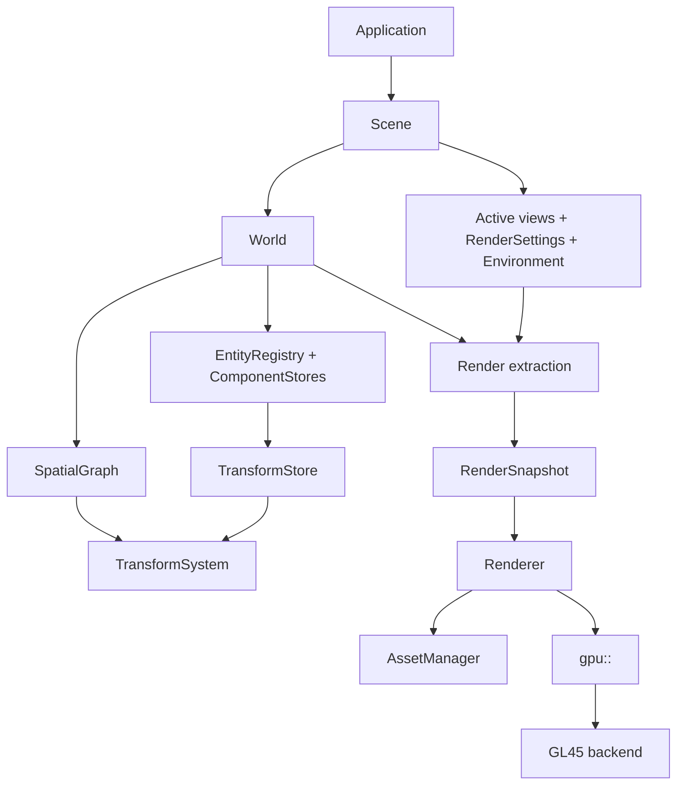

# Architecture logicielle — Gloop

## 0. Statut et rôle de ce document

Ce document définit l’architecture cible de Gloop à partir de l’état réel du

dépôt. Il remplace les anciennes descriptions qui mélangeaient :

- ce qui est déjà implémenté ;

- une architecture future ;

- les types du dossier legacy `src/Scene`.

Chaque décision appartient désormais à l’une des catégories suivantes :

- **Acquis** : implémenté, testé et à préserver ;

- **Cible** : contrat à atteindre par les prochaines refontes ;

- **Legacy** : code conservé comme référence, mais qui ne définit plus

  l’architecture ;

- **Éventuel** : évolution rendue possible, mais qui ne doit pas compliquer le

  présent.

`doc/Design.md` décrit les raisons de conception de la couche `gpu::` actuelle

et le prototype World Niveau 1. Le présent document porte la cible globale.

Lorsqu’une différence existe, elle doit être explicitement décrite comme une

migration, jamais masquée.

---

## 1. Vision

Gloop vise un moteur 3D C++ moderne, léger et orienté simulation, combinant :

- la rapidité de création d’une scène de Three.js ;

- un petit modèle Entity/Component inspiré de Unity ;

- des données contiguës adaptées aux traitements de masse ;

- une couche GPU utilisable pour le rendu comme pour le calcul.

Le moteur doit offrir deux niveaux d’usage.

### 1.1 API pratique

L’utilisateur doit pouvoir charger, instancier et observer un monde sans

assembler lui-même chaque passe GPU :

```cpp

World world;
AssetManager assets;
Scene scene(world);

auto carPrefab = assets.load<Prefab>("car.prefab");
auto car = world.instantiate(carPrefab);

world.transform(car).setPosition({ 10.0f, 0.0f, 20.0f });

scene.setActiveCamera(camera);

engine.run(scene);

```

Cette API est une cible. Elle n’existe pas encore sous cette forme.

### 1.2 API bas niveau

La couche `gpu::` reste directement accessible pour les simulations et rendus
spécialisés. Elle expose aujourd'hui des wrappers typés et une API immédiate, par
exemple :

```cpp
gpu::Status Triangle::setUp()
{
    GPU_TRY_ASSIGN(program,
                   gpu::Program::fromSources(VERTEX_SHADER, FRAGMENT_SHADER));
    m_program = std::move(program);

    const std::array<Vertex, 3u> corners{
        Vertex{ Vector2f(-0.8f, -0.6f), Vector3f(1.0f, 0.0f, 0.0f) },
        Vertex{ Vector2f(0.8f, -0.6f), Vector3f(0.0f, 1.0f, 0.0f) },
        Vertex{ Vector2f(0.0f, 0.8f), Vector3f(0.0f, 0.0f, 1.0f) }
    };

    GPU_TRY_ASSIGN(vertices,
                   gpu::Buffer<Vertex>::from(std::span<const Vertex>(corners),
                                             gpu::BufferKind::Vertex,
                                             gpu::BufferUsage::Immutable));
    m_vertices = std::move(vertices);

    const gpu::VertexLayout layout = GPU_LAYOUT(Vertex, position, color);

    GPU_TRY_ASSIGN(pipeline,
                   gpu::Pipeline::create<Vertex>(m_program, layout));
    m_pipeline = std::move(pipeline);

    m_attributes = m_pipeline.describeAttributes();

    return gpu::success();
}

gpu::Status Triangle::draw(Frame const& p_frame)
{
    gpu::PassDesc desc;
    desc.width = p_frame.width;
    desc.height = p_frame.height;
    desc.color = Vector4f(0.1f, 0.1f, 0.15f, 1.0f);
    GPU_TRY_ASSIGN(pass, gpu::RenderPass::begin(desc));

    return gpu::draw(m_pipeline, m_vertices);
}
```

Cette API constitue le socle acquis. Les couches supérieures doivent l'utiliser
sans la contaminer avec des concepts de World, Entity ou Scene.

### 1.3 Flux fondamental

```text

World

  → Simulation

  → TransformSystem

  → Render extraction

  → Renderer

  → gpu::

  → Backend

```

Le rendu représente le monde ; il ne le possède pas et ne pilote pas sa

simulation.

---

## 2. État réel du dépôt

### 2.1 Acquis : `src/GPU`

La couche `gpu::` est le socle graphique actuel. Elle est fonctionnelle,

testée et couverte par les exemples 01 à 16.

Elle fournit notamment :

- un backend OpenGL 4.5 isolé dans `src/GPU/Backends/GL45` ;

- des handles typés et générationnels ;

- des pools de ressources contigus ;

- des propriétaires de ressources move-only ;

- `gpu::Result<T>` et `gpu::Status` ;

- des buffers typés pour vertex, index, uniform et storage ;

- textures, framebuffers, shaders, programs et pipelines ;

- layouts vertex déclarés côté C++ et validés contre le shader ;

- états de rendu immuables dans les pipelines ;

- `RenderPass` et les appels `draw*` immédiats ;

- compute shaders, SSBO, barrières et ping-pong ;

- statistiques de rendu et de ressources.

Les contraintes suivantes sont acquises et ne doivent pas régresser :

1\. aucun type OpenGL public ;

2\. aucun `gl*` hors du backend ;

3\. un mesh peut alimenter plusieurs pipelines ;

4\. les erreurs de layout et de shader sont détectées avant le draw ;

5\. un buffer écrit par compute peut être réutilisé par le rendu ;

6\. la fenêtre et GLFW restent hors de la bibliothèque GPU.

### 2.2 Expérimental : `src/World`

`src/World` est un prototype utile, mais pas encore le contrat définitif.

Il valide déjà plusieurs choix :

- `Entity` est un handle index + génération ;

- la hiérarchie utilise `parent`, `first_child`, `next_sibling` et

  `prev_sibling` ;

- transforms locaux, matrices monde et dirty flags sont séparés ;

- les nœuds ne possèdent pas de callbacks virtuels de rendu ;

- le rendu collecte les renderables au lieu d’appeler `onDraw` sur l’arbre.

Il contient aussi des choix à corriger :

- `World` connaît directement `gpu::` et effectue le rendu ;

- caméra, lumière, matériau, mesh et rendu sont mélangés au noyau spatial ;

- l’échelle parentale n’est pas propagée aux enfants ;

- les composants optionnels utilisent encore des recherches linéaires ;

- `TransformAuthority` est stocké dans la valeur locale sans être appliqué ;

- `World::render` tient lieu à la fois d’extraction, de queue et de renderer.

L’exemple 17 est expérimental. Il ne constitue pas une preuve de stabilité tant

que son rendu n’est pas validé visuellement et par un test GPU hiérarchique.

### 2.3 Legacy : `src/Scene`

`src/Scene` n’est pas compilé. Il reste une source d’idées et d’assets de test,

mais pas une API à conserver telle quelle.

Les éléments à ne pas réintroduire sont :

- `vector<unique_ptr<Node>>` comme stockage principal ;

- allocations individuelles par nœud ;

- hiérarchie de classes pour représenter les données ;

- `onDraw` virtuel par objet ;

- mélange Scene Graph, gameplay et rendu ;

- ressources OpenGL possédées par les objets de scène.

Les concepts utiles du legacy peuvent être réimplémentés au-dessus des

nouveaux contrats : API pratique, comportements, formes, ShaderLib, loaders,

animation et contrôleurs de caméra.

---

## 3. Architecture cible

### 3.1 Modèle général

Gloop sépare explicitement quatre responsabilités :

```text
World
  = état et vérité de la simulation

SpatialGraph
  = relations hiérarchiques spatiales

Scene
  = composition et contexte de présentation d'un World

Renderer
  = projection graphique d'un état de World/Scene
```

Le modèle cible est **World-centric** : le World possède les Entities et les
composants. Le graphe spatial est un système de relations associé au World. La
Scene sélectionne et configure ce qui doit être observé/rendu.



### 3.2 Règle d'identité

Les concepts suivants sont distincts :

```text
Entity != SpatialNode != Component != GameObject
```

- une `Entity` est une identité du World ;
- un `SpatialNode` est une relation hiérarchique spatiale ;
- un composant est une donnée spécialisée associée à une Entity ;
- un éventuel `GameObject` est une façade ergonomique, pas un propriétaire de
  données lourdes.

Le Scene Graph ne constitue pas un deuxième système d'entités. Un nœud référence
une Entity existante. Une Entity peut exister sans être spatiale.

`SpatialGraph` est indépendant au sens de ses responsabilités et de sa
testabilité, mais il est composé et possédé par le `World` qui fournit les
Entities. Il ne possède aucun registre d'Entities concurrent.

### 3.3 World, Scene et SpatialGraph : contrat officiel

#### World

Le `World` est la **source de vérité**. Il possède l'état simulé : Entities,
composants, transforms, graphe spatial et systèmes de simulation. Il doit pouvoir
fonctionner sans renderer et sans GPU.

#### SpatialGraph

Le `SpatialGraph` ne décrit que les relations spatiales : parent, enfants et
parcours hiérarchique. Il ne possède ni Mesh, Material, PhysicsBody ou Behavior.

Le transform local appartient au `World`/`TransformStore`, pas au node. Le graphe
indique seulement **qui est parent de qui**.

#### Scene

Une `Scene` est un **contexte de présentation et d'exécution** d'un World. Elle
ne possède pas les Entities ni leurs composants. Elle peut sélectionner une ou
plusieurs vues du World et porter des paramètres de présentation : caméra active,
viewport, environnement, render settings et configuration des passes.

Les Cameras et Lights qui doivent faire partie du monde sont des composants
spécialisés d'Entities du World. Une Scene peut référencer leurs Entities et
désigner lesquelles sont utilisées pour une vue donnée.

Ainsi, une même simulation peut être présentée différemment sans dupliquer son
état :

```text
                    World
                     │
          ┌──────────┼──────────┐
          │          │          │
       Game view   Editor    Headless
          │
       Scene A
          │
     Camera + Lights
```

### 3.4 Sens des dépendances

```text
Application
  ├── Scene → World → SpatialGraph / Components / Systems
  └── Renderer → AssetManager → gpu:: → Backend

World ───────────────X────→ Renderer
World ───────────────X────→ gpu::
SpatialGraph ────────X────→ Renderer / gpu::
```

Une flèche signifie « utilise ». L'inverse est interdit.

En particulier :

- `World` ne dépend pas de `Scene`, `Renderer` ou `gpu::` ;
- `SpatialGraph` ne dépend ni du rendu ni de la physique ;
- `Renderer` lit un snapshot et ne modifie pas le World ;
- `gpu::` ne connaît ni Mesh métier, ni Material métier, ni Entity ;
- le backend ne voit pas les types du moteur.

---

## 4. World : vérité de la simulation

### 4.1 Responsabilité

Le `World` possède :

- le registre des Entities ;
- les ComponentStores ;
- le TransformStore ;
- le SpatialGraph associé ;
- les systèmes de simulation et leur ordre d'exécution ;
- le temps et les événements de simulation.

Le `World` ne possède pas :

- la fenêtre ;
- le contexte GPU ;
- le Renderer ;
- les RenderQueues ;
- les réglages propres à une vue ;
- le chargement/décodage des assets.

Les composants de rendu sont autorisés dans le World lorsqu'ils sont **déclaratifs**
et sans dépendance GPU. Par exemple, `MeshRenderer` peut contenir un `MeshAssetId`
et un `MaterialInstanceId`, mais jamais un `gpu::Pipeline`.

Un World doit pouvoir évoluer en mode headless :

```cpp
World world;

while (simulationRunning)
{
    world.update(dt);
}

save(world);
```

### 4.2 Entity

Une Entity est un handle compact et générationnel. La largeur exacte est une
décision d'implémentation ; elle ne doit pas imposer silencieusement une limite
16 bits.

```cpp
struct Entity
{
    uint32_t index;
    uint32_t generation;
};
```

Propriétés requises :

- copie peu coûteuse ;
- valeur nulle explicite ;
- détection des handles périmés ;
- réutilisation contrôlée des slots ;
- sérialisation possible ;
- aucun pointeur vers une allocation d'Entity.

### 4.3 ComponentStores

Les composants sont stockés par type :

```text
TransformStore
RigidBodyStore
ColliderStore
MeshRendererStore
AnimatorStore
BehaviorStore
CameraStore
LightStore
ParticleEmitterStore
```

Chaque store choisit la représentation adaptée aux traitements qui le consomment :

- dense SoA pour les données parcourues en masse ;
- sparse set pour les composants optionnels ;
- AoS compact lorsque cela correspond mieux au parcours réel.

Les objets spécialisés ne doivent donc pas être fusionnés dans une classe
`GameObject` universelle.

---

## 5. SpatialGraph : organisation spatiale

### 5.1 Responsabilité

Le graphe répond uniquement à la question :

> Quelle Entity est attachée à quelle autre Entity dans la hiérarchie spatiale ?

Il contient :

- l'association `NodeId → Entity` ;
- les relations parent/enfant ;
- les informations nécessaires au parcours ;
- aucun composant de gameplay ;
- aucune ressource de rendu ;
- aucun callback virtuel.

Le graphe ne possède pas les transforms. Les transforms appartiennent au
`TransformStore` du World.

### 5.2 Identifiants et nœuds

`NodeId` est un handle générationnel distinct d'`Entity`.

```cpp
struct SpatialNode
{
    Entity entity;
    NodeId parent;
    NodeId firstChild;
    NodeId nextSibling;
    NodeId prevSibling;
};
```

Les nœuds résident dans des tableaux contigus. `prevSibling` peut être conservé
pour permettre un détachement O(1) ; il s'agit d'un détail de stockage et non
d'une exigence de l'API publique.

Une Entity peut ne pas être spatiale. Une Entity spatiale possède au plus un nœud
dans un graphe donné.

### 5.3 Invariants

Le graphe garantit :

- absence de cycle ;
- parent vivant ou nul ;
- un nœud au plus par Entity ;
- invalidation générationnelle après destruction ;
- destruction et reparentage aux sémantiques explicites.

Le reparentage expose explicitement la politique de conservation :

```cpp
graph.attach(child, parent, KeepLocal);
graph.attach(child, parent, KeepWorld);
```

`KeepLocal` conserve le TRS local et modifie la pose monde. `KeepWorld` recalcule
le local afin de préserver la pose monde, si la matrice parentale est inversible.

---

## 6. Transforms

### 6.1 Source de vérité

Le TRS local est la donnée primaire éditable :

```cpp
struct LocalTransform
{
    Vec3 position;
    Quat rotation;
    Vec3 scale;
};
```

La transformation monde est une donnée dérivée/cache :

```cpp
struct WorldTransform
{
    Matrix4 matrix;
};
```

Une décomposition monde position/rotation/scale peut être calculée ou mise en
cache si un système en a besoin, mais elle ne devient pas une seconde source de
vérité.

### 6.2 Composition officielle

La hiérarchie adopte la sémantique TRS de référence de Three.js/Unity :

```text
WorldMatrix(root)  = LocalMatrix(root)
WorldMatrix(child) = WorldMatrix(parent) × LocalMatrix(child)
```

L'échelle du parent est donc héritée par défaut. Une hiérarchie sans héritage
d'échelle n'est pas la sémantique standard et devra être une fonctionnalité
explicitement nommée si elle devient nécessaire.

### 6.3 Stockage data-oriented

`LocalTransform` est une valeur d'API et d'échange ; il n'impose pas un
`vector<LocalTransform>` en interne.

Le stockage cible peut être :

```text
TransformStore
  entities[]
  positions[]
  rotations[]
  scales[]
  worldMatrices[]
  dirty[]
```

L'autorité d'écriture est une information de système/ordonnancement et ne doit
pas être embarquée dans chaque valeur TRS. Si une politique d'autorité est
nécessaire, elle peut vivre dans un store ou dans le scheduler.

L'API doit garantir qu'une modification marque le transform et les descendants
affectés comme dirty :

```cpp
world.transform(entity).setPosition({ 1.0f, 2.0f, 3.0f });
```

Une référence mutable brute vers une donnée interne n'est acceptable que si le
dirty tracking reste garanti.

### 6.4 TransformSystem

Le système :

1. reçoit les modifications locales ;
2. identifie les sous-arbres affectés ;
3. traite les parents avant les enfants ;
4. calcule les matrices monde ;
5. publie un état stable en lecture pour les systèmes suivants.

L'implémentation peut évoluer vers un parcours DFS, une liste topologique, des
sous-arbres dirty ou un calcul parallèle. Le contrat mathématique reste
inchangé.

### 6.5 Autorité d'écriture

Les systèmes peuvent écrire les transforms à des moments distincts :

```text
Game
Physics
Animation
```

Le contrat doit préciser quel système est autorisé à écrire un transform pendant
chaque phase. L'objectif est d'éviter qu'une animation et la physique écrivent
silencieusement la même donnée dans une même phase.

---

## 7. Scene : contexte de présentation

### 7.1 Responsabilité

Une `Scene` n'est pas propriétaire des Entities du World. Elle définit comment un
World est présenté et exécuté dans un contexte donné.

Elle peut contenir/référencer :

- le World observé ;
- les vues/caméras utilisées ;
- les Entities de lumière sélectionnées ;
- l'environnement ;
- les RenderSettings ;
- les paramètres de présentation propres à cette vue.

Les données lourdes et les composants restent dans le World.

```cpp
struct Scene
{
    World* world;
    Entity activeCamera;
    RenderSettings renderSettings;
    Environment environment;
};
```

Cette forme est conceptuelle. Les `Camera` et `Light` sont des composants
spécialisés du World lorsqu'ils représentent des objets spatiaux. La Scene ne
possède donc pas un second `CameraStore` ou `LightStore` concurrent.

Une même simulation peut être présentée par plusieurs Scenes : joueur, minimap,
éditeur, capture hors écran ou visualisation scientifique.

### 7.2 Camera et Light

Une caméra ou une lumière spatiale est une Entity du World munie du composant
correspondant :

```cpp
auto camera = world.create();
world.add<Transform>(camera);
world.add<Camera>(camera);

world.add<DirectionalLight>(sun);
```

La Scene référence ces Entities pour construire la vue. Leur pose provient du
TransformStore ; Camera et Light ne possèdent donc pas leur propre transform.

### 7.3 CameraFrame

Chaque frame produit une valeur immuable :

```cpp
struct CameraFrame
{
    Matrix4 view;
    Matrix4 projection;
    Matrix4 viewProjection;
    Matrix4 inverseView;
    Matrix4 inverseProjection;
    Vec3 position;
    Frustum frustum;
};
```

Les inverses peuvent être calculés seulement lorsqu'ils sont nécessaires. Le
frustum est dérivé de la camera frame et sert notamment au culling et au raycast
visuel.

---

## 8. Render extraction et Renderer

### 8.1 Frontière

Le World ne dessine pas. Il expose des données de simulation et des composants

de rendu déclaratifs, par exemple :

```cpp

struct Renderable

{

    MeshAssetId mesh;

    MaterialInstanceId material;

    AABB localBounds;

    RenderFlags flags;

};

```

Ce composant ne contient ni `gpu::Pipeline`, ni pointeur de matériau, ni appel

de rendu.

### 8.2 Snapshot de rendu

L’extraction construit une représentation immuable de la frame :

```cpp

struct RenderItem

{

    Entity entity;

    MeshAssetId mesh;

    MaterialInstanceId material;

    Matrix4 worldMatrix;

    AABB worldBounds;

    RenderFlags flags;

};

struct RenderSnapshot

{

    CameraFrame camera;

    Span<const RenderItem> items;

    Span<const LightFrame> lights;

    EnvironmentFrame environment;

};

```

Le snapshot :

- ne contient pas de pointeur mutable vers le World ;

- reste valide pendant la consommation de la frame ;

- permet plus tard de séparer simulation et rendu par thread ;

- fige les données nécessaires au rendu, pas tout le World.

### 8.3 Renderer

Le `Renderer` :

1\. reçoit un `RenderSnapshot` ;

2\. effectue le frustum culling ;

3\. choisit passes, pipelines et variantes ;

4\. construit et trie les queues ;

5\. résout les assets vers des ressources `gpu::` ;

6\. émet les appels `gpu::`.

Tri initial :

```text

pass

  → pipeline

  → material

  → mesh

  → profondeur

```

Le tri par adresse de pointeur n’est pas un contrat acceptable. Les clés sont

des identifiants stables ou des clés de pipeline calculées.

### 8.4 Multi-pass

Le modèle doit permettre à un même mesh d’être consommé par :

- pass profondeur ;

- ombres ;

- opaque ;

- transparent ;

- sélection éditeur ;

- debug normals.

Cette exigence s’appuie directement sur l’acquis `gpu::` : le layout et le

buffer ne sont pas enfermés dans un unique shader.

---

## 9. Couche `gpu::`

### 9.1 API actuelle à préserver

`gpu::` utilise un device implicite par processus :

```cpp

gpu::init(loadProc);

// ressources, passes, draw, compute

gpu::shutdown();

```

Il n’existe actuellement ni classe publique `GraphicsDevice`, ni

`CommandBuffer`, ni `ResourceState`.

Le backend OpenGL traduit immédiatement les opérations. Cette forme est

cohérente et doit rester la référence tant qu’un second backend n’impose pas

une évolution prouvée.

### 9.2 Ownership GPU

Les wrappers typés possèdent les ressources :

```text

gpu::Buffer<T>

gpu::Texture

gpu::Program

gpu::Pipeline

gpu::Framebuffer

```

Les handles sont copiables et non-owning. Copier un handle ne prolonge pas la

durée de vie de la ressource.

Les couches Assets et Renderer possèdent les wrappers nécessaires. Le World ne

stocke que des identifiants d’assets.

### 9.3 Évolutions éventuelles

Les éléments suivants restent possibles :

- backend Vulkan ;

- device explicite ;

- command buffers enregistrés ;

- resource states et barrières portables ;

- fences ;

- samplers séparés ;

- représentation shader portable.

Ils ne doivent pas être simulés dans l’API actuelle sans besoin concret. Un

backend futur doit préserver autant que possible la simplicité de `gpu::`.

---

## 10. Assets et ressources métier

### 10.1 AssetManager

L’`AssetManager` charge, met en cache, déduplique et possède les ressources partagées :

```text

MeshAsset

TextureAsset

Material

MaterialInstance

AnimationClip

Skeleton

Prefab

Model

```

Un Asset ID est stable du point de vue du moteur. Les handles GPU associés

peuvent être reconstruits après perte ou recréation du contexte.

### 10.2 glTF / GLB

GLB/glTF est le format runtime principal.

Le loader traduit :

- nodes → Entity + SpatialNode + Transform ;

- primitives → MeshAsset ;

- matériaux et textures → assets ;

- caméras et lumières → données de Scene ;

- skins et animations → composants et assets d’animation.

Le loader ne doit pas appeler directement OpenGL. Il produit des descriptions

CPU, puis l’AssetManager crée ou programme les ressources `gpu::`.

### 10.3 Material et MaterialInstance

```text

Material

  shader family

  render state

  parameter layout

MaterialInstance

  MaterialId

  parameter values

  texture bindings

```

Plusieurs instances partagent un Material. Plusieurs entités peuvent partager

la même instance si leurs paramètres sont identiques.

ShaderLib doit produire une description de matériau et de shader. Elle ne doit

pas posséder de types backend ou fabriquer des objets OpenGL.

---

## 11. Systèmes et ordre d’une frame

L’ordre d’écriture doit être explicite :

```text

Platform input

  → Gameplay / Behavior

  → Physics

  → Physics-to-local transform sync

  → Animation

  → TransformSystem

  → Scene evaluation

  → Render extraction

  → Renderer

  → gpu::

```

Cet ordre pourra devenir configurable, mais ses dépendances devront rester

déclarées.

Exemples d’autorité :

- une caisse dynamique : Physics → LocalTransform ;

- une porte animée : Animation → LocalTransform ;

- une caméra libre : Game → LocalTransform ;

- un objet cinématique : Game/Animation → Physics.

Aucun système ne doit corriger silencieusement la sortie d’un autre système au

milieu de la frame.

---

## 12. API haut niveau et façade objet

Une façade objet est autorisée si elle ne devient pas le stockage :

```cpp

class GameObject

{

public:

    TransformView transform();

    template<typename T>

    ComponentView<T> get();

private:

    World* m_world;

    Entity m_entity;

};

```

Elle peut offrir une ergonomie Three.js/Unity :

```cpp

auto player = scene.instantiate("Player.prefab");

player.transform().setPosition({ 0.0f, 1.0f, 0.0f });

player.get<Animator>().play("Idle");

```

Mais :

- elle ne contient pas les composants ;

- elle ne possède pas les ressources ;

- elle ne reçoit pas de `onDraw` ;

- sa destruction n’invalide rien sans opération explicite sur le World.

Les Behaviors sont des composants ou systèmes de gameplay. Ils peuvent

recevoir `onEnable`, `onDisable`, `onStart` et `onUpdate`, mais jamais prendre

la responsabilité du rendu.

---

## 13. Ownership

```text

World

  owns EntityRegistry, simulation components, TransformStore, SpatialGraph

Scene

  owns presentation configuration, cameras, lights, environment

AssetManager

  owns CPU assets and their GPU realizations

Renderer

  owns render infrastructure, queues, transient frame resources

gpu::

  owns backend resource records through typed wrappers and pools

Application

  owns Platform, World, Scene, AssetManager, Renderer

```

Règles :

1\. une Entity ne possède jamais une ressource GPU ;

2\. un SpatialNode ne possède jamais un composant ;

3\. un composant référence un asset par ID, pas par pointeur owning ;

4\. une Scene référence un World dont la durée de vie la dépasse ;

5\. un snapshot possède ou référence de façon bornée les données de sa frame ;

6\. toute référence non-owning a une durée de vie documentée.

---

## 14. Mémoire et performance

Priorités :

```text

contiguous storage

stable IDs

generation checks

batch processing

explicit ownership

measured optimization

```

À éviter dans les données massives :

- allocation heap par élément ;

- graphe de pointeurs ;

- virtual dispatch par entité pendant le rendu ;

- recherche linéaire pour chaque accès composant ;

- copie CPU inutile entre compute et draw ;

- état GPU caché dans les objets métier.

La performance ne justifie pas une API incohérente. Les optimisations doivent

être prouvées par les statistiques existantes, des benchmarks ou des scènes de

charge.

---

## 15. Roadmap à partir de l’état réel

Les étapes suivantes construisent les couches au-dessus de `gpu::`. Chaque étape
doit conserver le socle GPU existant et produire un exemple minimal fonctionnel.

### Étape 0 — Socle acquis

État :

- `gpu::` et backend GL45 fonctionnels ;
- exemples GPU existants ;
- tests GPU et compteurs de ressources ;
- `src/Scene` hors build ;
- prototype `src/World` expérimental.

### Étape 1 — Spatial Core

Livrables :

- EntityRegistry ;
- Entity générationnelle ;
- SpatialGraph ;
- NodeId distinct d'Entity ;
- TransformStore SoA ;
- TRS local avec héritage d'échelle ;
- WorldTransform dérivé ;
- dirty propagation ;
- reparentage `KeepLocal` / `KeepWorld` ;
- détection des cycles et handles périmés.

Critère de sortie : une hiérarchie robotique est correcte mathématiquement sans
aucune dépendance à `gpu::`.

### Étape 2 — World / Components

Livrables :

- World ;
- ComponentStore ;
- composants spécialisés ;
- MeshRenderer déclaratif ;
- Camera ;
- Lights ;
- RigidBody/Collider placeholders si nécessaire pour tester les frontières.

Critère de sortie : le World peut être mis à jour en mode headless et aucune
Entity ne possède de ressource GPU.

### Étape 3 — Scene et Render Extraction

Livrables :

- Scene comme contexte de présentation ;
- sélection de Camera/Light ;
- Renderable basé sur Asset IDs ;
- CameraFrame ;
- RenderSnapshot ;
- Render extraction ;
- Renderer minimal ;
- RenderQueue ;
- pass opaque ;
- frustum culling minimal.

Critère de sortie : `World` ne dépend plus de `gpu::`, et le Renderer consomme un
snapshot sans modifier la simulation.

### Étape 4 — Camera, Frustum et Raycast visuel

Livrables :

- Perspective / Orthographic ;
- Frustum ;
- AABB / Sphere bounds ;
- `screenRay()` ;
- OrbitController ;
- FlyController ;
- FPSController ;
- raycast géométrique minimal.

Critère de sortie : une caméra peut naviguer, sélectionner un objet et effectuer
un culling correct.

### Étape 5 — Assets, GLTF/GLB et Materials

Livrables :

- AssetManager ;
- MeshAsset ;
- TextureAsset ;
- glTF/GLB loader ;
- Material ;
- MaterialInstance ;
- ShaderLib refactoré par fonctionnalités ;
- cache et déduplication ;
- import de hiérarchie ;
- PBR minimal.

Critère de sortie : un GLB statique peut être chargé et rendu avec ses textures,
matériaux et transforms sans code GPU utilisateur.

### Étape 6 — Prefab et Serialization

Livrables :

- Prefab ;
- PrefabInstance ;
- SceneSerializer ;
- sérialisation des Entities et composants ;
- références d'assets par ID ;
- sauvegarde/chargement d'une scène.

Critère de sortie : un modèle ou objet complexe peut être instancié plusieurs fois
et une scène peut être sauvegardée puis rechargée.

### Étape 7 — Animation

Livrables :

- AnimationClip ;
- Skeleton / Skin ;
- AnimationAction ;
- AnimationMixer ;
- interpolation ;
- loop ;
- speed ;
- crossfade ;
- skinning GPU ;
- autorité Animation sur les transforms concernés.

Critère de sortie : un GLB animé joue plusieurs clips avec transition.

### Étape 8 — Physics et Raycast physique

Livrables :

- PhysicsWorld ;
- RigidBody ;
- Collider ;
- Trigger ;
- synchronisation explicite avec TransformStore ;
- autorité Physics ;
- raycast physique.

Critère de sortie : objets dynamiques, cinématiques et animés ne se disputent pas
implicitement l'écriture d'un transform.

### Étape 9 — Rendering avancé

Livrables progressifs :

- PBR complet ;
- Environment / HDR / IBL ;
- Directional / Point / Spot lights ;
- shadow maps ;
- transparence ;
- HDR framebuffer ;
- tone mapping ;
- gamma / color management ;
- FXAA ;
- particules ;
- DebugDraw.

Chaque fonctionnalité reste un pass, un système ou une extension du Renderer ;
aucun callback de rendu n'est ajouté aux Entities.

### Étape 10 — GPU Simulation

Livrables :

- données de composants transférables par lots ;
- compute produisant des données directement dessinables ;
- SSBO ;
- ping-pong ;
- indirect draw lorsque pertinent ;
- synchronisation CPU/GPU explicite ;
- readback ciblé/asynchrone lorsque nécessaire.

Exemples : particules, foules, galaxie, trafic, simulation scientifique.

Cette étape ne nécessite pas de déplacer tout le World sur GPU.

### Étape 11 — Navigation, Audio et Editor

Évolutions :

- NavMesh ;
- NavMeshAgent ;
- PathFinder ;
- AudioSource ;
- AudioListener ;
- Asset Browser ;
- Hierarchy ;
- Inspector ;
- Viewport ;
- Gizmos ;
- hot reload.

### Étape 12 — Évolutions infrastructurelles éventuelles

Seulement lorsqu'un besoin concret le justifie :

- threading simulation/rendu ;
- command buffers enregistrés ;
- resource states ;
- fences ;
- device explicite ;
- backend Vulkan.

Ces évolutions ne doivent pas polluer les contrats du MVP.

---

## 16. Migration progressive

### 16.1 Principe

La migration se fait par tranche verticale :

```text

contrat

  → tests CPU

  → implémentation

  → test GPU si nécessaire

  → exemple

  → documentation

```

Chaque étape doit laisser le dépôt compilable et démontrable.

### 16.2 `src/World`

Ordre recommandé :

1\. extraire EntityRegistry ;

2\. introduire SpatialGraph ;

3\. introduire TransformStore et la composition TRS correcte ;

4\. adapter les tests World ;

5\. créer les types d’extraction ;

6\. déplacer le draw dans Renderer ;

7\. adapter l’exemple 17 ;

8\. supprimer les helpers temporaires de mesh et matériau du noyau World.

### 16.3 `src/Scene`

Le legacy n’est pas déplacé fichier par fichier.

Pour chaque fonctionnalité :

1\. identifier le contrat utilisateur utile ;

2\. écrire un type de données indépendant du backend ;

3\. l’intégrer au bon propriétaire ;

4\. porter ou remplacer son exemple ;

5\. supprimer l’ancien code devenu sans usage.

Les anciens `GameObject`, `SceneTree::Node`, `Behavior::onDraw` et ressources

OpenGL ne sont pas des dépendances de transition acceptables.

### 16.4 Compatibilité

La compatibilité source avec `src/Scene` n’est pas un objectif. Une petite

façade moderne peut reprendre les noms utiles si leur sémantique respecte les

nouveaux contrats.

---

## 17. Critères de qualité

Une fonctionnalité est correctement intégrée si :

### Architecture

- son propriétaire est explicite ;

- elle respecte le sens des dépendances ;

- elle ne mélange pas simulation et présentation ;

- elle n’expose pas OpenGL hors backend ;

- elle fonctionne sans façade objet.

### Données

- les handles périmés sont détectés ;

- les données massives sont parcourables par lots ;

- les relations utilisent des IDs stables ;

- la représentation est adaptée aux systèmes qui la consomment ;

- les caches dérivés ne deviennent pas des sources de vérité.

### Rendu

- aucun appel GPU n’est émis par une Entity ou un Behavior ;

- un mesh peut participer à plusieurs passes ;

- les queues utilisent des clés stables ;

- les ressources sont libérées et observables dans les statistiques ;

- le culling ne change pas l’état du World.

### Validation

- tests CPU pour les règles métier et mathématiques ;

- tests GPU ciblés pour les frontières de rendu ;

- exemple visuel pour chaque tranche verticale ;

- erreurs explicites plutôt que rendu silencieusement vide ;

- documentation mise à jour avec le code.

---

## 18. Non-objectifs immédiats

Les éléments suivants ne doivent pas retarder le spatial core et le Renderer

minimal :

- ECS universel ou framework de systèmes générique ;

- éditeur complet ;

- backend Vulkan ;

- multithreading prématuré ;

- réseau ;

- FBX ;

- format binaire propriétaire ;

- abstraction anticipée de toutes les API graphiques ;

- reproduction exhaustive d’Unity ou Unreal.

Gloop doit rester petit. Chaque abstraction doit résoudre un besoin démontré

par un test, un exemple ou une fonctionnalité de la roadmap.

---

## 19. Décisions résumées

1. `gpu::` actuel est le socle graphique acquis.
2. World est la source de vérité de la simulation.
3. Entity est une identité générationnelle.
4. SpatialNode est une relation spatiale, pas une Entity.
5. Le SpatialGraph n'est pas un second registre d'Entities.
6. Le SpatialGraph est possédé/composé par le World mais reste indépendant de ses composants.
7. Le TRS local est la donnée primaire ; le transform monde est dérivé.
8. La composition hiérarchique suit le TRS standard avec héritage d'échelle.
9. Le parent appartient au SpatialNode, pas au Transform.
10. Le reparentage expose explicitement `KeepLocal` et `KeepWorld`.
11. L'autorité d'écriture est une règle de système/ordonnancement, pas une propriété du TRS.
12. World ne dépend ni de Scene, ni de Renderer, ni de `gpu::`.
13. Camera et Light sont des composants spécialisés du World lorsqu'ils sont spatiaux.
14. Scene référence un World et définit un contexte de présentation : vues, caméra active, environnement et render settings.
15. Render extraction produit un snapshot ; Renderer ne modifie pas le World.
16. MeshRenderer et autres composants de rendu sont déclaratifs et référencent les assets par ID.
17. AssetManager possède les assets et leurs réalisations GPU ; World ne possède pas les ressources GPU.
18. Material et MaterialInstance sont séparés ; ShaderLib produit des variantes/compositions sans connaître le backend.
19. Animation, Physics, Behavior, Particles, Navigation et Audio sont des systèmes/couches spécialisés ; ils ne deviennent pas des responsabilités du Scene Graph.
20. Une façade GameObject peut exister pour l'ergonomie mais ne constitue pas le stockage.
21. `src/Scene` est migré par fonctionnalité puis supprimé progressivement.
22. Les abstractions Vulkan et les primitives de threading avancées restent éventuelles tant qu'un besoin réel ne les impose pas.

La chaîne cible est donc :

```text
GLB / Prefab / Code
        ↓
AssetManager
        ↓
World
        ↓
Entity + Components + SpatialGraph
        ↓
TransformSystem
        ↓
Scene / Views
        ↓
Render extraction
        ↓
RenderSnapshot
        ↓
Renderer
        ↓
gpu::
        ↓
GL45 backend
        ↓
GPU
```
