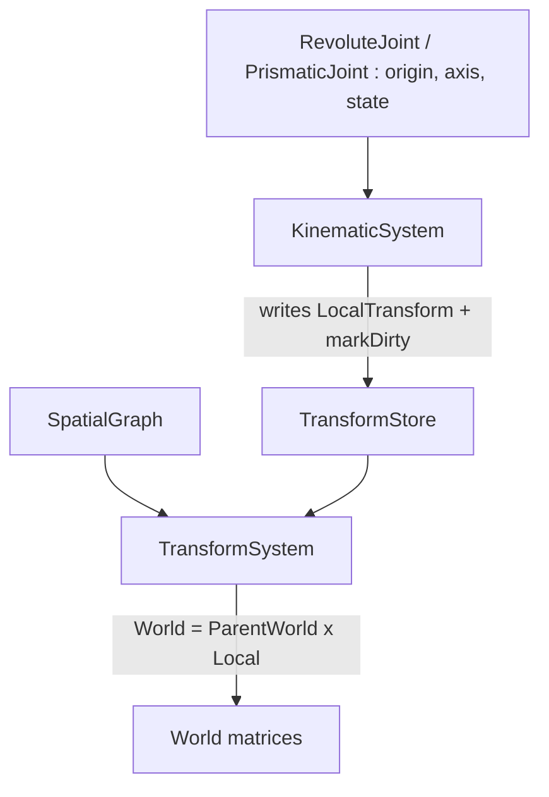

# Compages architecture

Compages is a C++20 GPU, rendering and simulation library. It does not own the
window or the event loop: the host opens a context and hands over a function to
resolve driver symbols with.

## Three layers

```text
include/Compages/
  Core/    Result, Status, file utilities, vectors, quaternions, matrices, bounds
  GPU/     the device: Drawable, Buffer, Texture, Program, Pipeline, passes, compute
  Scene/   World and Entity, components, behaviors, Scene, Assets/, Render/

src/       the same three folders, plus GPU/Backends/ (the only code allowed
           to include a gl* header)
tests/     Core/ GPU/ Scene/
examples/  the gallery; legacy/ holds the old demos, not compiled
attic/     Physics/, parked out of the build
```

Each layer only uses the ones above it in this list. `Scene/` has no window,
`GPU/` has no entity, `Core/` has no device.

The only public aggregate include is:

```cpp
#include <Compages/Compages.hpp>
```

## GPU: the shader first

A `gpu::Drawable` is a program and the data it reads. The shader is the entry
point: its reflection says which attributes, uniforms and samplers exist, and
the C++ side fills them by name, or from an interleaved struct whose fields are
named after the attributes.

```cpp
gpu::Drawable triangle;
COMPAGES_TRY(triangle.load(vertex_src, fragment_src));
triangle["position"] = { { -0.8f, -0.6f }, { 0.8f, -0.6f }, { 0.0f, 0.8f } };
triangle["color"]    = { { 1, 0, 0 }, { 0, 1, 0 }, { 0, 0, 1 } };
triangle["time"]     = 0.5f;          // a uniform, by the same syntax

triangle.draw();   // sends what changed, then draws
```

Nothing is sent when a value is assigned; everything pending is sent at the
next draw. The lower pieces (`Buffer<T>` with its CPU mirror, `Pipeline`,
`RenderPass`, `draw`, `drawIndexed`, `drawIndirect`, compute) stay public for
what a Drawable does not cover, and a Drawable can borrow a `Buffer<T>`
written by a compute shader.

## Errors

Loading can fail for reasons outside the program (a shader that does not
compile, a missing file), so it returns `compages::Result<T>` or
`compages::Status`, and `COMPAGES_TRY` forwards the sentence.

A frame is different: a misspelled uniform should not need a check after every
line. Those mistakes are reported with `gpu::reportError`; the first one is kept,
since it is the cause, and the others are counted. `gpu::takeFrameError()` hands
it back, and `Scene::prepare()`
turns them into a `Status`. The gallery shows them on top of the picture.

## Scene: a World and a view on it

`scene::World` is the simulation. It wraps an EnTT registry, a `SpatialGraph`
for parentage and a SoA `TransformStore`, and it never touches the device, so it
runs headless in a test or on a server. Entities are built flecs-style:

```cpp
scene::World world;
scene::Entity ship = world.entity("Ship").set(Velocity{ 1, 0, 0 });
ship.child("Gun").position(0, 0.5f, 0);

world.each<Velocity>([](scene::Entity e, Velocity& v) { ... });
world.lookup("Ship/Gun");
```

`EntityId` is the 32-bit identity stored in components; `Entity` is the handle
that carries its World, and the one application code uses.

`scene::Scene` shows a World. It owns (or shares) an `AssetManager`, a
`Renderer`, the active camera, the background, the environment and debug
lines, and gives Three.js-style shortcuts:

```cpp
scene::Scene scene(world);
scene.camera().position(0, 2, 6).add<scene::Orbit>();
scene.sun();
scene.box("Crate", scene::texture("wooden-crate.jpg"));
scene.sphere("Ball", scene::color(1, 0.3f, 0.2f)).position(2, 0, 0);
scene.load("Duck.glb");

scene.draw(frame);   // update, then render with the active camera
```

The split is deliberate: several Scenes can show the same World (a split
screen, a map), and a World can live without any Scene.

## Kinematics

A robot is the same hierarchy as a game scene, with one difference: the place
of a link relative to its parent is not free, it is set by a joint. A joint
is a component of the child entity (`RevoluteJoint` or `PrismaticJoint`); the
`SpatialGraph` stays the only topology. A fixed joint needs no component, it
is the plain local transform.

```cpp
scene::Entity base = world.entity("Base");
scene::Entity arm = base.child("Arm").position(0, 0, 0.5f)
                        .revolute({ 0, 0, 1 }, -90.0_deg, 90.0_deg);
scene::Entity hand = arm.child("Hand").position(0, 0, 0.3f)
                        .revolute({ 0, 1, 0 }, -45.0_deg, 45.0_deg);
arm.angle(30.0_deg);
hand.angle(-10.0_deg);
```

On an entity with a joint, `position()`, `rotation()` and `scale()` set the
joint origin: the place of the link when the joint is at zero. The
`KinematicSystem` then writes the local transform of every jointed entity,
before the `TransformSystem` propagates the world matrices:

```text
Local = Origin * Rotation(axis, q)        RevoluteJoint
Local = Origin * Translation(axis * q)    PrismaticJoint
```



Each joint holds a `JointState`: position, velocity and acceleration, each a
`Bounded` value in the units of `Units.hpp` (radians or meters, per second,
per second squared). Only the position moves the link; the velocity and the
acceleration are the `(q, v, a)` a planner or Pinocchio reads and writes.

`scene.load("robot.urdf")` builds such a chain from a URDF file, with its
STL meshes.

## Behaviors

A behavior is code hung on an entity, Unity-style:

```cpp
struct Spin : scene::Behavior
{
    explicit Spin(float p_speed) : speed(p_speed) {}
    void update(float p_dt) override { transform().rotateY(speed * p_dt); }
    float speed;
};

scene.box("Cube").add<Spin>(2.0f);
```

`start()` runs once before the first `update(dt)`. Inside, `entity()`,
`transform()`, `world()`, `input()` and `frame()` reach what the behavior
works on. `entity.get<Spin>()`, `has<Spin>()` and `remove<Spin>()` work the
same for behaviors as for components. Entities disabled in the hierarchy do
not run theirs. `Orbit` and `Fly` are the camera controls, written as
behaviors.

## Frame flow

```text
Scene::draw(frame)
    Scene::update(frame)
        World::update(frame)      behaviors: start() once, then update(dt)
        AnimationSystem           glTF clips sampled onto entities
        World::update()           joints turned into local transforms,
                                  then transforms propagated
        skinning                  poses sent to the skinned meshes
    Scene::render(active camera)
        pass over the camera viewport, cleared to the background
        skybox
        SceneExtractor            World -> RenderSnapshot
        Renderer                  sorted, culled, drawn
        debug lines
```

For several views, call `update(frame)` once and `render(camera)` for each
camera. For a headless simulation, call `world.update(frame)` only.

## Render boundary

`SceneExtractor` is the only place where the World is read for drawing. It
copies the renderable state into a `RenderSnapshot`: camera matrices, lights,
item transforms and typed asset ids, with no pointer into the World. The
`Renderer` consumes the snapshot and the `AssetManager` and never reads the
World.

## Assets versus instances

```cpp
auto asset = assets.load("city.glb");   // reusable prefab, no World argument
auto first = scene.instantiate(asset);
auto second = scene.instantiate(asset);

auto direct = scene.load("duck.glb");   // load + instantiate
```

`AssetManager` owns meshes, textures, materials, skins, animation clips and
prefabs. Components store typed generational ids, never pointers. Instantiation
remaps glTF node indices, skin joints and animation targets to the entities of
that particular instance.

## Physics

The ReactPhysics3D adapter and its examples are parked in `attic/Physics/`,
out of the build. They will come back as components and a system written on the
`scene::` API above.

## Build and installation

```text
make download-external-libs
make
make -C tests
```

EnTT is header-only. Installation copies `include/Compages/**`, the EnTT
headers and `units.h` that public headers need, `libCompages` and the
`Compages.pc` pkg-config file. Nothing under `src/` is installed.

The numbered progression of the examples and their budgets are executable
contracts in `examples/Common/ExampleManifest.hpp`, documented in
[examples/README.md](../examples/README.md).
